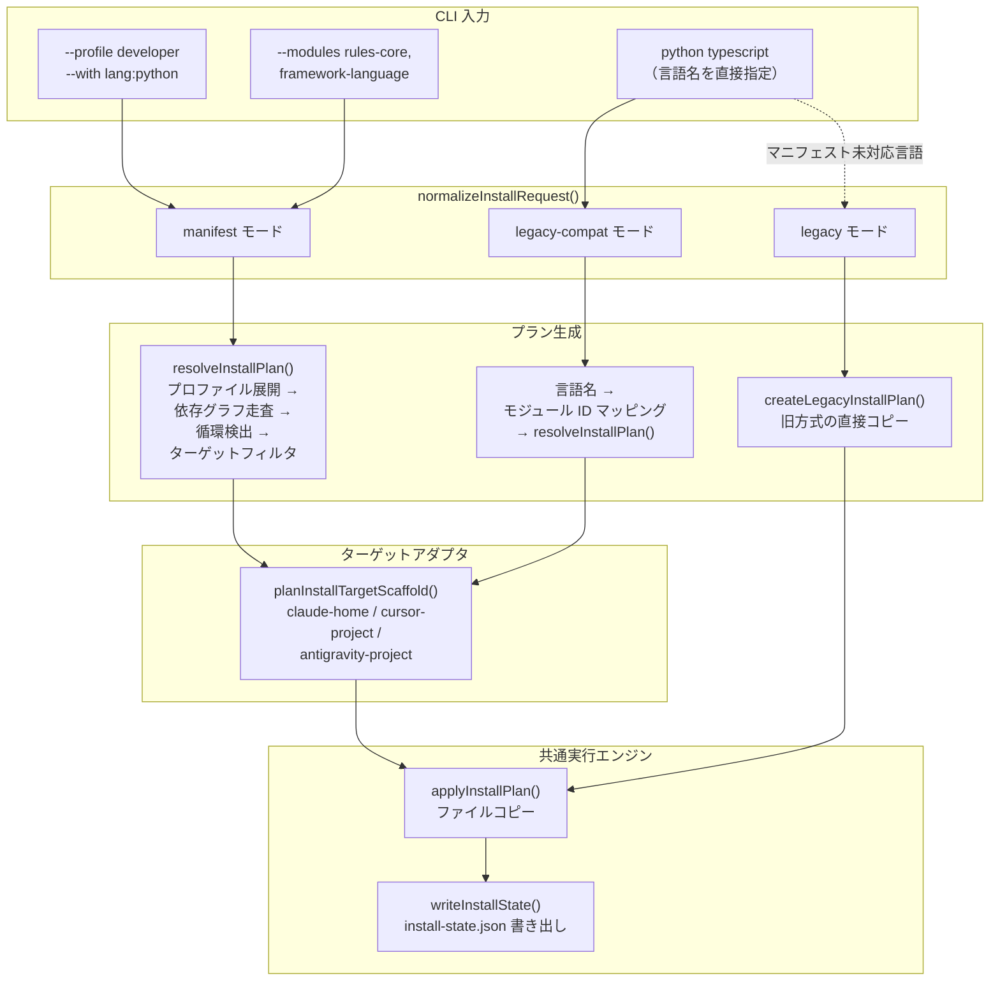
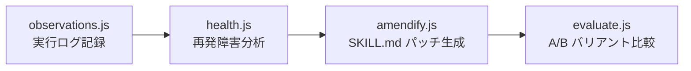

# v1.9.0 — Selective Install & Language Expansion 調査レポート

**調査日:** 2026-03-27
**対象バージョン:** everything-claude-code v1.9.0（v1.8.0..v1.9.0、219コミット）
**調査者:** Claude Opus 4.6
**対象領域:** v1.9.0 で導入された全機能

---

## 1. v1.9.0 で何が変わったのか

v1.8.0 が ECC を「ハーネスパフォーマンス最適化システム」として再定義したのに対し、v1.9.0 はそのシステムの**拡張性と自己改善能力**を確立したリリースである。

大きく3つの方向性がある:

1. **選択的インストール基盤** — マニフェスト駆動のインストールパイプラインにより、「全部入れるか何も入れないか」から「必要なものだけを選んで入れる」に転換した。
2. **言語エコシステムの拡張** — Java、PHP、Perl、Kotlin/Android/KMP、C++、Rust の6言語が追加され、対応言語が12に到達した。
3. **自己改善インフラ** — SQLite 状態ストア、セッションアダプタ、スキル進化基盤により、ECC 自身が自らの動作を記録・分析・改善するための基盤が整った。

以下、各機能を実際のコードに基づいて解説する。

---

## 2. 選択的インストールアーキテクチャ

### 2.1 問題の背景

v1.8.0 まで、ECC のインストールは言語ベースの単純なコピーだった。`install.sh --languages typescript,python` のように言語を指定すると、対応するルール・スキル・エージェントが一括でコピーされる仕組みである。この方式には以下の問題があった:

- **粒度が粗い。** 「TypeScript のルールだけ欲しいが Agent は不要」という選択ができない。
- **追加・更新が追跡できない。** 何がインストール済みで何が未インストールかをシステムが把握していない。
- **修復ができない。** ユーザーがファイルを誤って削除しても、再インストール以外の手段がない。

### 2.2 マニフェスト駆動のアーキテクチャ

v1.9.0 では、インストール対象の定義を3層の JSON マニフェストに分離した。

```
manifests/
  install-modules.json     ← 最小単位。ファイルパスの集合
  install-components.json  ← ユーザー向けのグループ（複数モジュールの束）
  install-profiles.json    ← プリセット（minimal / standard / full）
```

**モジュール**は最小のインストール単位である。各モジュールには ID、対象パス、対応ターゲット（Claude, Cursor, Antigravity）、依存関係、コスト（light / medium / heavy）が定義されている。

```json
{
  "id": "rules-core",
  "kind": "rules",
  "description": "Shared and language rules...",
  "paths": ["rules"],
  "targets": ["claude", "cursor", "antigravity"],
  "dependencies": [],
  "defaultInstall": true,
  "cost": "light",
  "stability": "stable"
}
```

**コンポーネント**はモジュールをユーザー向けにまとめたものである。`lang:kotlin` と指定すれば、Kotlin のルール・エージェント・スキルを含むモジュール群が選択される。

**プロファイル**はコンポーネントをさらに束ねたプリセットである。`minimal` はルールとコマンドのみ、`full` は全19モジュールを含む。

### 2.3 インストールコマンドの比較

v1.8.0 までと v1.9.0 以降で、同じ「Python と TypeScript を入れたい」という要求の表現方法が変わった。

**v1.8.0（旧方式 -- 言語指定）:**

```bash
# 言語名をそのまま渡す。どのファイルがコピーされるかはスクリプトに埋め込まれている。
./install.sh python typescript
```

**v1.9.0（新方式 -- マニフェスト駆動）:**

```bash
# 方法1: プロファイルで一括指定
# developer プロファイルには framework-language モジュールが含まれ、
# Python/TypeScript 両方のスキルが入っている
./install.sh --profile developer --target claude

# 方法2: コンポーネントで個別指定
# lang:python と lang:typescript はどちらも framework-language モジュールに解決される
./install.sh --with lang:python --with lang:typescript --target claude

# 方法3: モジュール ID を直接指定（上級者向け）
./install.sh --modules rules-core,framework-language --target claude

# 方法4: 旧方式との互換モード（内部で legacy-compat モードに自動判定される）
./install.sh python typescript
```

新旧いずれの書き方でも動作する。旧方式で言語名を渡すと `normalizeInstallRequest()` が `legacy-compat` モードと判定し、言語名をマニフェストのモジュール ID にマッピングして処理を続行する。

### 2.4 処理のルーティング

この仕組みの要点は、CLI 入力が3つのモードに分岐し、それぞれ異なるプランナーで処理された後、共通の実行エンジンに合流する点にある。



3つのモードすべてが最終的に同じ `applyInstallPlan()` + `writeInstallState()` を通過する。どの入口から入っても状態追跡の恩恵を受けられる設計である。

`resolveInstallPlan()`（`scripts/lib/install-manifests.js`）が manifest / legacy-compat 両モードの中核ロジックを担う。プロファイルとコンポーネントをモジュール ID に展開し、依存グラフを走査して循環を検出し、ターゲット互換性でフィルタリングした上で、コピー操作のリストを返す。

**`scripts/lib/install/apply.js`** の実行エンジン自体はシンプルである:

```javascript
function applyInstallPlan(plan) {
  for (const operation of plan.operations) {
    fs.mkdirSync(path.dirname(operation.destinationPath), { recursive: true });
    fs.copyFileSync(operation.sourcePath, operation.destinationPath);
  }
  writeInstallState(plan.installStatePath, plan.statePreview);
  return { ...plan, applied: true };
}
```

### 2.4 ターゲットアダプタ

インストール先のディレクトリ構造はハーネスごとに異なるため、アダプタパターンで抽象化している。

| アダプタ | ターゲット | ルートパス | 用途 |
|---------|-----------|-----------|------|
| `claude-home` | Claude Code | `~/.claude` | ユーザーホーム |
| `cursor-project` | Cursor | `./.cursor` | プロジェクト |
| `antigravity-project` | Antigravity | `./.agent` | プロジェクト |
| `codex-home` | Codex | `~/.codex` | ユーザーホーム |
| `opencode-home` | OpenCode | `~/.opencode` | ユーザーホーム |

各アダプタは `scripts/lib/install-targets/` に個別ファイルとして定義され、`registry.js` で統合される。アダプタの責務は、入力の検証、ルートパスの解決、状態ファイルパスの算出、コピー操作の生成の4つである。

### 2.5 インストール状態の追跡

すべてのインストール操作は `ecc.install.v1` スキーマの JSON ファイルとして記録される。状態ファイルにはインストール日時、対象ターゲット、選択されたモジュール、個々のファイル操作（コピー元・コピー先・所有権区分）が含まれる。

```json
{
  "schemaVersion": "ecc.install.v1",
  "installedAt": "2026-03-27T...",
  "target": { "id": "claude-home", "target": "claude", "kind": "home" },
  "request": { "profile": "full", "modules": ["rules-core", ...] },
  "resolution": { "selectedModules": [...], "skippedModules": [...] },
  "operations": [
    {
      "kind": "copy-file",
      "moduleId": "rules-core",
      "sourceRelativePath": "rules/common/coding-style.md",
      "destinationPath": "~/.claude/rules/common/coding-style.md",
      "ownership": "managed"
    }
  ]
}
```

**`scripts/lib/install-lifecycle.js`**（1,225行）は状態に基づくライフサイクル管理を提供する。`discoverInstalledStates()` で既存の状態ファイルを検出し、`buildDoctorReport()` で各ファイルの健全性（変更済み・欠落・破損）を診断し、`repairInstalledStates()` で欠落ファイルを復元する。`uninstallInstalledStates()` でのクリーンなアンインストールも可能になった。

### 2.6 マニフェスト網羅性の確保

ここで言う「マニフェスト」とは、セクション 2.2 で解説した3つの JSON ファイルのことである。具体的には `manifests/install-modules.json`（モジュール定義）、`manifests/install-components.json`（コンポーネント定義）、`manifests/install-profiles.json`（プロファイル定義）の3ファイルで、`skills/` ディレクトリに存在するスキルがこれらのファイルのいずれかのモジュールの `paths` に列挙されていなければ、インストール対象にならない。

commit `609a0f4` の時点で、`skills/` に存在する105スキルのうち62がどのモジュールの `paths` にも含まれていなかった。つまり `--profile full` を指定しても6割近いスキルがインストールされない状態だった。

この修正では5つの新モジュールが `manifests/install-modules.json` に追加された:

| 新モジュール | 含まれるスキル数 | 例 |
|------------|--------------|-----|
| `swift-apple` | 6 | SwiftUI パターン、Swift Concurrency 6.2、Liquid Glass |
| `agentic-patterns` | 17 | agent harness construction、autonomous loops、cost-aware LLM pipeline |
| `devops-infra` | 2 | deployment patterns、Docker patterns |
| `supply-chain-domain` | 8 | logistics、procurement、production scheduling |
| `document-processing` | 2 | Nutrient 文書処理、visa-doc-translate |

既存モジュール（`framework-language`、`database`、`workflow-quality`、`security`）にも18以上のスキルパスが追加され、`manifests/install-profiles.json` の `full` プロファイルが全19モジュールを含むように更新された。

---

## 3. 新規エージェント（7体）

v1.9.0 では7つの専門エージェントが追加され、エージェント総数は25以上に到達した。すべて `sonnet` モデルで動作し、「surgical fix（最小限の外科的修正）のみを行い、リファクタリングはしない」という共通哲学に従う。

### 3.1 一覧

| エージェント | ファイル | 目的 | 特徴的な検査項目 |
|------------|---------|------|----------------|
| `typescript-reviewer` | `agents/typescript-reviewer.md` | TypeScript/JS のコードレビュー | `eval` / XSS / prototype pollution、React hooks 依存配列、`async forEach` |
| `pytorch-build-resolver` | `agents/pytorch-build-resolver.md` | PyTorch の実行時エラー解決 | テンソル形状追跡、CUDA デバイス配置、勾配計算障害、混合精度 |
| `java-build-resolver` | `agents/java-build-resolver.md` | Java/Maven/Gradle のビルドエラー修正 | アノテーションプロセッサ（Lombok, MapStruct）、依存関係ツリー解析 |
| `java-reviewer` | `agents/java-reviewer.md` | Java/Spring Boot のコードレビュー | N+1 問題、`@Transactional` 配置、エンティティ露出、状態遷移検証 |
| `kotlin-reviewer` | `agents/kotlin-reviewer.md` | Kotlin/Android/KMP のレビュー | GlobalScope 検出、Compose 再コンポジション防止、モジュール境界 |
| `kotlin-build-resolver` | `agents/kotlin-build-resolver.md` | Kotlin/Gradle のビルドエラー修正 | 網羅的 when 式、detekt/ktlint 統合、Kotlin コンパイラフラグ |
| `rust-reviewer` | `agents/rust-reviewer.md` | Rust のコードレビュー | `unsafe` 正当化の強制（`// SAFETY:` コメント必須）、所有権パターン、Send/Sync |

### 3.2 エージェント設計パターン

すべてのレビュー系エージェントは同じワークフローに従う:

1. `git diff` で変更範囲を取得する
2. CI の状態を確認する（`cargo check`、`./gradlew build` 等）
3. 変更されたファイルを全文読み込む
4. 言語固有のチェックリストを適用する
5. 重大度別（CRITICAL / HIGH / MEDIUM / LOW）に報告する

ビルド解決系エージェントは異なるフローを取る:

1. ビルドコマンドを実行してエラーを取得する
2. エラーメッセージからパターンを照合する（事前定義の10〜12パターン）
3. 対象ファイルを読み、最小限の修正を適用する
4. 再ビルドして修正を検証する
5. 同じエラーが3回続いたら停止する

### 3.3 `pytorch-build-resolver` の詳細

このエージェントは他のビルド解決系と異なり、テンソルのデバッグに特化した診断を行う。`torch.cuda.memory_allocated()` による GPU メモリ監視、テンソル形状のプリントデバッグの自動挿入、勾配フローの検証が含まれる。「モデルアーキテクチャはエラーが要求しない限り変更しない」という制約が明示されている。

10のエラーパターンテーブルが定義されている:

| エラー | 原因 | 修正 |
|--------|------|------|
| `mat1 and mat2 shapes cannot be multiplied` | 線形層の入力サイズ不一致 | `in_features` を前層の出力に合わせる |
| `Expected all tensors on same device` | CPU/GPU 混在 | `.to(device)` の追加 |
| `CUDA out of memory` | GPU メモリ不足 | バッチサイズ削減、勾配チェックポイント |
| `element 0 of tensors does not require grad` | 計算グラフ切断 | `.detach()` の除去、`requires_grad=True` |

---

## 4. 新規スキル

v1.9.0 では20以上の新規スキルが追加された。技術スキル、プロセススキル、ドメインスキルの3カテゴリに分かれる。

### 4.1 技術スキル

| スキル | ファイル | 目的 |
|-------|---------|------|
| `pytorch-patterns` | `skills/pytorch-patterns/SKILL.md` | PyTorch のイディオマティックなパターン集。デバイス非依存コード、再現性設定、混合精度訓練、`torch.compile` 最適化 |
| `documentation-lookup` | `skills/documentation-lookup/SKILL.md` | Context7 MCP 経由でライブラリの最新ドキュメントを取得する。訓練データの古い情報に頼らず、`resolve-library-id` → `query-docs` のフロー |
| `bun-runtime` | `skills/bun-runtime/SKILL.md` | Bun を JS ランタイム・パッケージマネージャ・バンドラ・テストランナーとして統一的に使う知識。Vercel デプロイ対応含む |
| `nextjs-turbopack` | `skills/nextjs-turbopack/SKILL.md` | Next.js 16+ の Turbopack（Rust ベースインクリメンタルバンドラ）。大規模プロジェクトで5〜14倍の高速化 |
| `mcp-server-patterns` | `skills/mcp-server-patterns/SKILL.md` | Node/TypeScript SDK での MCP サーバー構築。Tools, Resources, Prompts の登録パターン、stdio vs Streamable HTTP |

### 4.2 プロセススキル

| スキル | ファイル | 目的 |
|-------|---------|------|
| `architecture-decision-records` | `skills/architecture-decision-records/SKILL.md` | Michael Nygard 形式の ADR を `docs/adr/` に記録する。コーディング中の意思決定を構造化して保存し、将来の「なぜこうなっているのか」に答える |
| `codebase-onboarding` | `skills/codebase-onboarding/SKILL.md` | 4フェーズ（偵察 → アーキテクチャマッピング → 規約検出 → 成果物生成）で未知のコードベースを分析し、オンボーディングガイドと CLAUDE.md を生成する |
| `agent-eval` | `skills/agent-eval/SKILL.md` | Claude Code、Aider、Codex 等のコーディングエージェントを同一タスクで比較評価する。Git worktree 分離、pass@k メトリクス |
| `click-path-audit` | `skills/click-path-audit/SKILL.md` | UI のボタン・タッチポイントを状態遷移の全シーケンスで追跡し、個別には動くが組み合わせると壊れるバグを発見する |
| `santa-method` | `skills/santa-method/SKILL.md` | 2つの独立したレビューエージェントが両方合格しなければ出力を許可しない。最大3回の修正ループ付き |
| `prompt-optimizer` | `skills/prompt-optimizer/SKILL.md` | 6フェーズのパイプラインでプロンプトを分析・最適化する。ECC コンポーネントのマッチング、不足コンテキストの検出を含む。タスク実行はしない助言役 |
| `data-scraper-agent` | `skills/data-scraper-agent/SKILL.md` | GitHub Actions + Gemini Flash（無料枠）でデータ収集を自動化。Collect → Enrich → Store の3層。フォールバックチェーン付き |

### 4.3 業務ドメインスキル（8スキル）

Evos 社の貢献により、15年以上の業務経験が体系化された8つのスキルが追加された。すべて `skills/{skill-name}/SKILL.md` に格納されている。

| スキル | 対象領域 | 知識の核 |
|-------|---------|---------|
| `energy-procurement` | 電力・ガス調達 | 料金体系分析、需要チャージ管理、PPA 評価、負荷プロファイリング |
| `inventory-demand-planning` | 需要予測・在庫最適化 | 移動平均/指数平滑/季節分解、安全在庫、ABC/XYZ 分析 |
| `carrier-relationship-management` | 運送業者管理 | レート交渉、スコアカード、ルーティングガイド、RFP プロセス |
| `quality-nonconformance` | 品質管理 | NCR ライフサイクル、5 Whys / Ishikawa / 8D、CAPA、SPC |
| `customs-trade-compliance` | 通関・貿易コンプライアンス | HS 関税分類、Incoterms 2020、FTA 活用、制裁リストスクリーニング |
| `logistics-exception-management` | 物流例外処理 | 例外分類、Carmack Amendment、キャリア別責任モデル、不正検出 |
| `returns-reverse-logistics` | 返品・リバースロジスティクス | 検品グレーディング（A〜D）、処分経済学、不正パターン認識 |
| `production-scheduling` | 生産スケジューリング | DBR（ドラム・バッファ・ロープ）、SMED、OEE 分析、段取り最適化 |

---

## 5. セッション・状態インフラ

### 5.1 SQLite 状態ストア

**ファイル:** `scripts/lib/state-store/`（`index.js`、`migrations.js`、`queries.js`、`schema.js`）

ネイティブモジュールのコンパイル問題を避けるため、better-sqlite3 ではなく sql.js（純粋な JavaScript/WASM 実装の SQLite）を採用している。sql.js の `db.export()` がアクティブなトランザクションを暗黙的に終了させるという仕様に対処するため、`inTransaction` フラグでディスク書き込みを遅延させるラッパーを実装している。

sql.js のデータベースファイルはデフォルトで `~/.claude/ecc/state.db` に保存される。パスの決定ロジックは `scripts/lib/state-store/index.js` の `resolveStateStorePath()` にあり、優先順位は (1) 呼び出し元が渡す `options.dbPath`、(2) `:memory:`（インメモリ DB）、(3) `$HOME/.claude/ecc/state.db` のフォールバックである。CLI ツール（`scripts/status.js`、`scripts/sessions-cli.js`）は `--db <path>` フラグでパスを上書きできる。sql.js 自体は npm パッケージ（`sql.js ^1.14.1`）として `package.json` に宣言されており、`require('sql.js')` で読み込まれる。

```javascript
function wrapSqlJsDatabase(rawDb, dbPath) {
  let inTransaction = false;

  function saveToDisk() {
    if (dbPath === ':memory:' || inTransaction) return;
    const data = rawDb.export();
    fs.writeFileSync(dbPath, Buffer.from(data));
  }

  const db = {
    transaction(fn) {
      return (...args) => {
        rawDb.run('BEGIN');
        inTransaction = true;
        try {
          const result = fn(...args);
          rawDb.run('COMMIT');
          inTransaction = false;
          saveToDisk();
          return result;
        } catch (error) {
          rawDb.run('ROLLBACK');
          inTransaction = false;
          throw error;
        }
      };
    }
  };
}
```

データベーススキーマは8テーブルで構成される:

| テーブル | 目的 |
|---------|------|
| `sessions` | ECC セッションのメタデータと状態スナップショット（JSON） |
| `skill_runs` | スキル実行の結果、トークン数、所要時間、フィードバック |
| `skill_versions` | コンテンツハッシュによるバージョン追跡。プロモーション・ロールバック対応 |
| `decisions` | セッション中の意思決定。理由、代替案、上位決定との関連 |
| `install_state` | ターゲットごとのインストールプロファイルとモジュール |
| `governance_events` | イベント種別、ペイロード、解決状態 |

クエリ API は `listSessions()`、`getSessionDetail()`、`getSkillRunSummary()`、`getInstallationHealth()` などを提供し、`scripts/sessions-cli.js` から CLI 経由でアクセスできる。

### 5.2 セッションアダプタ

**ファイル:** `scripts/lib/session-adapters/`

#### 何を解決するのか

ECC がセッション状態を記録するとき、情報の発生源が一つではないという問題がある。Claude Code をターミナルで直接使っているなら Claude CLI の履歴（`~/.claude/projects/` 以下の JSON ファイル群）が情報源になる。しかし、`dmux` で複数エージェントを tmux 上で並列実行しているなら、各ワーカーの状態ファイル（`STATUS.md`、`TASK.md`、`HANDOFF.md`）が情報源になる。さらに、ECC 自身の Hook（`session-start.js` / `session-end.js`）が記録するデータもある。

これら3つの情報源はフォーマットが異なる。Claude CLI は JSON、dmux は Markdown、ECC Hook はまた別の構造を持つ。セクション 5.1 の SQLite 状態ストアや、セクション 5.3 のスキル進化基盤がセッション情報を分析するとき、フォーマットの違いを毎回吸収するのは非効率である。

#### Claude Code の memory 機能との違い

Claude Code の memory（`CLAUDE.md`、`~/.claude/memory/`）は**指示の永続化**を目的とする。「このプロジェクトでは conventional commit を使え」のような、セッションをまたいで適用したいルールや嗜好を保存する。

一方、セッションアダプタが扱うのは**動態データ**である。「今この瞬間、worker-2 は `feature/auth` ブランチで active 状態にあり、最終更新は3分前」という情報は memory に書くものではない。セッション中のワーカー状態、使用トークン量、スキル実行結果といったデータは、リアルタイムに変化し、セッション終了後は履歴として参照される性質のものである。

この動態データの消費者は具体的に4つある:

1. **オーケストレーション監視**（`scripts/orchestration-status.js`）— dmux で並列実行中のワーカー群の健全性をリアルタイムに表示する。stale（5分以上無応答）や degraded（失敗状態）のワーカーを検出し、介入判断を支援する。
2. **スキル改善パイプライン**（`scripts/lib/skill-improvement/`）— スキル実行の成功/失敗記録を読み、繰り返し失敗するスキルの SKILL.md 修正パッチを生成する（セクション 5.3 参照）。
3. **セッション検査 CLI**（`scripts/session-inspect.js`）— `skills:health` や `skills:amendify` サブコマンドで、スキルの健全性レポートや修正提案を出力する。
4. **SQLite 状態ストアへの永続化**（`canonical-session.js`）— 正規化したスナップショットを状態ストアに書き込み、過去セッションの横断的なクエリを可能にする。横断クエリが解決する具体的な問題は3つある。第一に、**スキル障害パターンの検出**である。`scripts/lib/inspection.js` の `detectPatterns()` が全セッションのスキル実行結果を集約し、同一スキル＋同一失敗理由の組み合わせが閾値（デフォルト3回）を超えると繰り返し障害として報告する。単一セッション内では散発的に見える失敗も、横断的に見ると系統的な欠陥として浮上する。第二に、**スキル健全性の傾向監視**である。`queries.js` の `summarizeSkillRuns()` が直近のスキル実行（デフォルト20件）の成功率・失敗率を算出し、`scripts/status.js` のダッシュボードに表示する。特定スキルの成功率が低下傾向にあることを早期に検知し、SKILL.md の修正パッチ生成（セクション 5.3）につなげる。第三に、**オーケストレーション全体の可観測性**である。`getStatus()` がアクティブセッション数、未解決のガバナンスイベント数、インストール健全性を一覧表示し、運用者が介入すべき箇所を即座に判断できるようにする。

#### アダプタの構成

セッションアダプタは、これらの異なるソースを統一スキーマ `ecc.session.v1` に正規化する。

| アダプタ | ファイル | 入力ソース | 具体的な情報源 |
|---------|---------|-----------|-------------|
| `canonical-session` | `canonical-session.js` | ECC 独自の構造化記録 | Hook が書き出す JSON（session-start.js / session-end.js の出力） |
| `claude-history` | `claude-history.js` | Claude CLI の履歴 | `~/.claude/projects/` 以下の会話履歴ファイル |
| `dmux-tmux` | `dmux-tmux.js` | マルチエージェント tmux/worktree オーケストレーション | 各ワーカーの STATUS.md / TASK.md / HANDOFF.md |
| `registry` | `registry.js` | ターゲット種別からアダプタを自動選択 |

正規化されたスナップショットには、セッション状態（active / idle / completed / failed）、ワーカー一覧（各ワーカーのブランチ・worktree・ランタイム情報）、ワーカー健全性（healthy / stale / degraded / unknown）が含まれる。健全性は以下のルールで導出される:

- 失敗状態 → `degraded`
- 完了状態 → `healthy`
- 実行中 + 5分以上更新なし → `stale`
- 実行中 + 最近更新あり → `healthy`

### 5.3 スキル進化基盤

**ファイル:** `scripts/lib/skill-evolution/`

スキルの実行履歴を追跡し、失敗パターンを検出して改善提案を生成するインフラである。

4つのモジュールで構成される:

- **`versioning.js`** — バージョン管理。現行スキルは `SKILL.md`、過去バージョンは `.versions/v1.md`、`.versions/v2.md` に保管。
- **`provenance.js`** — 修正・プロモーション・ロールバックの監査ログ。
- **`tracker.js`** — セッション単位のスキル呼び出し追跡。
- **`health.js`** — 成功/失敗のサマリーと再発パターンの検出。

自己改善ループ（`scripts/lib/skill-improvement/`）は4段階のパイプラインを形成する:



ここで言う「失敗」は、`observations.js` が記録する `outcome` オブジェクトの `success` フィールドに基づく。各スキル実行は以下の構造で記録される:

`success` の真偽値は観測システムが自動判定するものではなく、`createSkillObservation()` の呼び出し元が明示的に渡すパラメータである。呼び出し元が外部の評価ロジックに基づいて `success: true` または `false` を決定する。現時点で `createSkillObservation()` を本番コードから呼び出す自動化されたパスは存在せず、テストスイート（`tests/lib/skill-improvement.test.js`）が想定される呼び出しパターンを示している。テストでは、エラー条件の有無（`error: 'playwright timeout'` があれば `success: false`、なければ `success: true`）やユーザーフィードバックの内容で成否を明示的に設定している。将来的に自動化する場合、テストランナーの終了コード、ユーザーからの修正フィードバック、検証ステップの合否が判定材料となる設計である。なお、セクション 6.2 の Observer（continuous-learning-v2）が `observations.jsonl` に記録するツール呼び出しイベントとは別のシステムであり、Observer はスキル実行の成否ではなくツール使用パターンを対象としている。`observations.js` はこの値を `Boolean()` で正規化し、`status` フィールド（`'success'` / `'failure'`）を自動導出するだけである。

`outcome` オブジェクトは後続の3ステージで段階的に消費される。まず `health.js` が全観測記録を走査し、`outcome.success === false` の件数を集計してスキルの健全性状態（`healthy` / `watch` / `failing`）を導出する。同時に `outcome.error` と `outcome.feedback` を出現回数でグルーピングし、再発パターンを抽出する。次に `amendify.js` が、`failing` 状態のスキルについて再発エラーと再発フィードバックを証拠として SKILL.md の修正パッチ（Markdown フラグメント）を生成する。最後に `evaluate.js` が、パッチ適用前（`variant: 'baseline'`）と適用後（`variant: 'amended'`）の `outcome.success` 成功率を比較し、改善が確認されれば `'promote-amendment'`、そうでなければ `'keep-baseline'` を推奨する。

```javascript
outcome: {
  success: true | false,    // この真偽値が判定の基準
  status: 'success' | 'failure',
  error: 'Network timeout',  // エラーメッセージ（あれば）
  feedback: null              // ユーザーからのフィードバック（あれば）
}
```

`health.js` の `deriveSkillStatus()` は `outcome.success === false` の記録を失敗としてカウントし、蓄積数に応じて3段階に分類する:

| 失敗回数 | 状態 | 意味 |
|---------|------|------|
| 0 | `healthy` | 問題なし |
| 1 | `watch` | 経過観察。単発の失敗はノイズの可能性がある |
| 2以上 | `failing` | 再発パターンあり。`amendify` が修正パッチを生成 |

閾値の2回はデフォルト値であり、`minFailureCount` オプションで変更できる。`evaluate` はオリジナルと修正版をバリアント実行で比較し、改善が確認された場合のみ適用する。

---

## 6. オーケストレーション改善

### 6.1 決定的なハーネス監査スコアリング

**ファイル:** `scripts/harness-audit.js`

v1.8.0 で導入された `/harness-audit` コマンドのスコアリングが決定的に再設計された。同じリポジトリ状態に対して常に同じスコアを返すよう、すべてのチェックが以下の3種類の二値判定に統一された。

**ファイル存在確認** — 特定のファイルが存在するかどうか:

```javascript
// Hook 設定ファイルの存在（2点）
{ pass: fileExists('hooks/hooks.json') }

// セッション永続化スクリプトの存在（4点）— 両方必要
{ pass: fileExists('scripts/hooks/session-start.js')
     && fileExists('scripts/hooks/session-end.js') }
```

**カウント閾値** — ディレクトリ内のファイル数が一定以上かどうか:

```javascript
// Hook スクリプトが8個以上あるか（2点）
{ pass: countFiles('scripts/hooks', '.js') >= 8 }

// Agent 定義が10個以上あるか（2点）
{ pass: countFiles('agents', '.md') >= 10 }

// Skill 定義が20個以上あるか（2点）
{ pass: countFiles('skills', 'SKILL.md') >= 20 }

// テストファイルが10個以上あるか（3点）
{ pass: countFiles('tests', '.test.js') >= 10 }
```

**コンテンツ比較** — 異なるハーネスのコマンド定義が同期されているかを検証する。ECC は Claude Code・OpenCode・Cursor・Codex の4つのハーネスをサポートしており、それぞれが独自のディレクトリ構造を持つ（Claude Code は `commands/`、OpenCode は `.opencode/commands/`）。ハーネス監査コマンド自体の定義ファイル `harness-audit.md` を比較対象としている。同一内容であればクロスハーネスの同期が維持されていることの証拠となり、2点が加算される。逆に内容が乖離していれば、あるハーネスでは最新の監査ロジックが適用されるが別のハーネスでは古いままという設定ドリフトが発生しているため、不合格となる:

```javascript
// commands/ と .opencode/commands/ のファイル内容が一致するか（2点）
const primary = safeRead('commands/harness-audit.md').trim();
const parity  = safeRead('.opencode/commands/harness-audit.md').trim();
{ pass: primary.length > 0 && primary === parity }

// hooks.json 内に PreToolUse または beforeSubmitPrompt が含まれるか（2点）
{ pass: hooksJson.includes('beforeSubmitPrompt')
     || hooksJson.includes('PreToolUse') }
```

各チェックは合格すれば固定点数を獲得し、不合格なら0点で具体的な `fix` メッセージ（修正手順）が提示される。

7カテゴリ・合計56点満点のスコアリング:

| カテゴリ | 最大点 | チェック例 |
|---------|-------|----------|
| Tool Coverage | 10 | hooks.json 存在、8+ hook スクリプト、20+ skill 定義 |
| Context Efficiency | 9 | 戦略的コンパクション、モデルルーティング、コスト認識 |
| Quality Gates | 9 | テスト、リンティング、CI カバレッジ |
| Memory Persistence | 8 | 状態ストア、意思決定ログ、クラッシュ復旧 |
| Eval Coverage | 7 | 評価ハーネス、テストスキャフォールド |
| Security Guardrails | 8 | リスクスコアリング、サプライチェーン検証 |
| Cost Efficiency | 5 | トークン予算、スロットリングポリシー |

### 6.2 Observer の5層ガード

Observer は ECC のバックグラウンド学習システムである。ユーザーの Claude Code セッション中、`PreToolUse` / `PostToolUse` フックを通じてツール呼び出しの内容を `observations.jsonl` に記録する。20件蓄積すると Haiku を起動して分析させ、繰り返し出現するパターンを confidence スコア付きのインスティンクト（学習済みパターン）として保存する。以降のセッションでコンテキストとして参照される。

Observer は分析のために Haiku セッションを自動起動する。この Haiku セッションも Claude Code のセッションであるため、observe.sh フックが再び発火し、「Haiku のツール呼び出しを観測 → 蓄積 → また Haiku 起動 → また観測...」という無限ループが発生する。ここで言う「自動セッション」とは、ユーザーが手動で開始したものではなく、ECC のシステムがプログラム的に起動する非対話的な Claude セッションである。この問題に対し、コストの低い順に5層の防御を導入した:

```bash
# Layer 1: エントリポイントチェック（環境変数）
# cli / sdk-ts 以外（自動化されたセッション）は即座に終了
case "${CLAUDE_CODE_ENTRYPOINT:-cli}" in
  cli|sdk-ts) ;;
  *) exit 0 ;;
esac

# Layer 2: minimal Hook プロファイル
# ECC_HOOK_PROFILE=minimal の場合はスキップ
[ "${ECC_HOOK_PROFILE:-standard}" = "minimal" ] && exit 0

# Layer 3: 協調的スキップフラグ
# ECC_SKIP_OBSERVE=1 が設定されていればスキップ
[ "${ECC_SKIP_OBSERVE:-0}" = "1" ] && exit 0

# Layer 4: サブエージェント検出
# agent_id が存在すればスキップ（Python サブプロセスで解析）
_ECC_AGENT_ID=$(echo "$INPUT_JSON" | python -c \
  "import json,sys; print(json.load(sys.stdin).get('agent_id',''))")
[ -n "$_ECC_AGENT_ID" ] && exit 0

# Layer 5: CWD パス除外（パターンマッチング）
# observer-sessions, .claude-mem 等のパスにいる場合はスキップ
_ECC_SKIP_PATHS="${ECC_OBSERVE_SKIP_PATHS:-observer-sessions,.claude-mem}"
```

オブザーバー自身が Haiku を起動する際には `ECC_SKIP_OBSERVE=1 ECC_HOOK_PROFILE=minimal` を設定し、自らのセッションが観測対象にならないようにする。

### 6.3 Observer メモリ爆発の修正

**ファイル:** `skills/continuous-learning-v2/hooks/observe.sh`、`agents/observer-loop.sh`

3つの修正が適用された:

**SIGUSR1 スロットリング:** ツール呼び出しごとにオブザーバーにシグナルを送るのではなく、N 回に1回だけ送る（デフォルト N=20）。

```bash
SIGNAL_EVERY_N="${ECC_OBSERVER_SIGNAL_EVERY_N:-20}"
counter=$((counter + 1))
if [ "$counter" -ge "$SIGNAL_EVERY_N" ]; then
  should_signal=1
  counter=0
fi
```

**再入ガード:** 分析中に新たなシグナルが到着しても無視する。

```bash
ANALYZING=0
on_usr1() {
  [ "$ANALYZING" -eq 1 ] && return
  ANALYZING=1
  # ... 分析実行 ...
  ANALYZING=0
}
```

**クールダウン + テールサンプリング:** 分析の最小間隔を60秒に設定し、LLM に送る観測データを直近500行に制限する。実装は `skills/continuous-learning-v2/agents/observer-loop.sh` にある。クールダウンは `ANALYSIS_COOLDOWN` 変数（デフォルト60秒、`ECC_OBSERVER_ANALYSIS_COOLDOWN` で変更可能）で制御され、前回分析からの経過時間が閾値未満なら分析をスキップする。テールサンプリングは `MAX_ANALYSIS_LINES` 変数（デフォルト500行、`ECC_OBSERVER_MAX_ANALYSIS_LINES` で変更可能）で制御され、`observations.jsonl` の末尾500行だけを一時ファイルに抽出して分析に渡す。送信先の LLM は Haiku である。Observer は `observations.jsonl` に蓄積されたツール呼び出しの記録を Haiku に送り、繰り返し出現するパターンを confidence スコア付きのインスティンクト（学習済みパターン）として抽出させる。数メガバイトに成長した観測ファイル全体を Haiku に送ればトークンコストが爆発するため、テールサンプリングで直近の観測に限定している。

500行は少なく見えるが、実用上は妥当な設計である。1回のツール呼び出しで `tool_start` と `tool_complete` の2行が記録されるため、500行は約250回のツール呼び出し、対話的なセッション1〜2時間分に相当する。インスティンクト生成の閾値は「同一パターン3回以上」であり、1〜2時間のウィンドウ内で十分に到達する。より長期にわたるパターンについては、ファイルベースのローリング蓄積で補完される。Haiku が生成したインスティンクトファイル（`.yaml`）はディスクに永続化され、次回の分析サイクルで同じパターンが再び500行ウィンドウ内に出現すると、既存ファイルの confidence スコアが加算される（確認観測ごとに +0.05、矛盾観測で -0.1、観測なしの週ごとに -0.02 の減衰）。各分析サイクルは直近500行しか見ないが、インスティンクトファイルが過去の分析結果を累積的に保持するため、セッションをまたいだ長期パターンも段階的に高い confidence として浮上する。500行という上限はトークンコスト抑制と検出精度のトレードオフとして意図的に選択されたものであり（Issue #521 の修正）、`ECC_OBSERVER_MAX_ANALYSIS_LINES` 環境変数で変更可能である。

これらの修正により、正のフィードバックループ（指数的なトークン消費の暴走）が有界な線形サイクルに変換された。

---

## 7. 12言語エコシステム

### 7.1 追加された6言語

v1.9.0 で追加された6言語の一覧と、それぞれで提供されるコンポーネント:

| 言語 | ルール | エージェント | コマンド | スキル |
|------|-------|-----------|---------|-------|
| **Java** | coding-style, hooks, patterns, security, testing | java-build-resolver, java-reviewer | — | springboot-patterns, jpa-patterns, springboot-tdd, springboot-security |
| **PHP** | coding-style, hooks, patterns, security, testing | — | — | laravel-patterns, laravel-tdd, laravel-security |
| **Perl** | coding-style, hooks, patterns, security, testing | — | — | perl-patterns, perl-security, perl-testing |
| **Kotlin/KMP** | coding-style, hooks, patterns, security, testing | kotlin-reviewer, kotlin-build-resolver | gradle-build, kotlin-build, kotlin-review, kotlin-test | kotlin-patterns, kotlin-testing, kotlin-coroutines-flows, kotlin-exposed-patterns, kotlin-ktor-patterns, android-clean-architecture, compose-multiplatform-patterns |
| **C++** | coding-style, hooks, patterns, security, testing | cpp-build-resolver, cpp-reviewer | cpp-build, cpp-review, cpp-test | cpp-coding-standards, cpp-testing |
| **Rust** | — (スキルで代替) | rust-reviewer, rust-build-resolver | rust-build, rust-review, rust-test | rust-patterns, rust-testing |

### 7.2 ルール設計の共通構造

すべての言語ルールは `rules/{lang}/` に5ファイルで構成される統一パターンに従う:

| ファイル | 内容 |
|---------|------|
| `coding-style.md` | フォーマッター、命名規則、インポート規約 |
| `hooks.md` | CI に組み込む検査コマンド |
| `patterns.md` | エラーハンドリング、状態管理、アーキテクチャパターン |
| `security.md` | インジェクション防止、認証・認可、シークレット管理 |
| `testing.md` | テスト構造、カバレッジ要件、モック戦略 |

### 7.3 Kotlin エコシステムの特筆事項

Kotlin は最も大規模な追加であり、7つの専門スキルを持つ。Android/KMP/Compose Multiplatform のすべてをカバーし、`kotlin-ktor-patterns`（719行）や `kotlin-testing`（824行）は単独で小規模な教科書に相当する。ルールの `security.md` には Android 固有のリスク（exported コンポーネント、安全でない WebView、機密データのログ出力）が含まれる。

---

## 8. コミュニティ貢献

### 8.1 翻訳（4言語）

| 言語 | ディレクトリ | 規模 | 貢献者 |
|------|-----------|------|--------|
| 韓国語 | `docs/ko-KR/` | 50+ ファイル（README, CONTRIBUTING, 用語集, エージェント16件, コマンド22件, サンプル） | hahmee |
| 中国語（簡体字） | `docs/zh-CN/` | 40+ ファイル更新（Kotlin, Perl, PHP 追加、コードブロック翻訳） | zdocapp |
| ポルトガル語（ブラジル） | `docs/pt-BR/` | 48 ファイル・6,000+ 行 | pvgomes |
| トルコ語 | `docs/tr/` | 完全な翻訳（README, エージェント20件, コマンド47件, トラブルシューティング） | — |

### 8.2 InsAIts セキュリティフック

**ファイル:** `scripts/hooks/insaits-security-monitor.py`（269行）、`scripts/hooks/insaits-security-wrapper.js`（88行）

PostToolUse フェーズでツール入力をリアルタイムに監視するセキュリティフック。Python 3.9+ で動作し、Claude Code のツール実行結果を受け取って、クレデンシャルの露出、プロンプトインジェクション、ハルシネーション、行動異常を検出する。PR #370（Nomadu27）による貢献。

**導入方法:** デフォルトでは無効（opt-in）。有効にするには環境変数 `ECC_ENABLE_INSAITS=1` を設定する。`insaits-security-wrapper.js` がこの変数を確認し、未設定なら入力をそのまま素通りさせる。Python 側の依存として `pip install insa-its` が必要。Python が見つからない場合は警告を出して fail-open（ツール実行を許可）する。

**モードの切り替え:** 環境変数 `INSAITS_DEV_MODE` で制御する。

| 環境変数 | 値 | 動作 |
|---------|-----|------|
| `INSAITS_DEV_MODE` | `1`（デフォルト） | 検出結果を stderr にログ出力するが、ツール実行はブロックしない（fail-open） |
| `INSAITS_DEV_MODE` | `0` | 重大度の高い検出でツール実行をブロックする（fail-closed）。本番環境向け |

すべての検出結果は `.insaits_audit_session.jsonl` に追記形式で記録され、セッション後に監査できる。

### 8.3 Biome フック最適化

**ファイル:** `scripts/hooks/post-edit-format.js`（216行）、`scripts/lib/resolve-formatter.js`（185行）

フォーマッターの呼び出し方法を根本から改善し、**52倍**の高速化を達成した。具体的には:

- `npx` 経由のサブプロセス起動をやめ、ローカルバイナリを直接解決する
- 複数ファイルのフォーマット呼び出しを1回に統合する
- `require()` による直接モジュール読み込みに切り替える

`resolve-formatter.js` はフォーマッターバイナリの探索結果をキャッシュし、2回目以降の起動コストをゼロにする。PR #359（pythonstrup）による貢献。

### 8.4 VideoDB スキル

**ファイル:** `skills/videodb/`（12ファイル、SKILL.md + 10のリファレンスガイド + WebSocket リスナースクリプト）

動画・音声の統合操作プラットフォームであり、VideoDB API（videodb.io）をバックエンドとして使用する。ローカルの ffmpeg や moviepy は使わず、すべてのメディア処理をサーバーサイドで実行する設計である。PR #301（0xrohitgarg）による貢献。

スキルは SKILL.md と10本のリファレンスガイド、WebSocket リスナースクリプト（`scripts/ws_listener.py`）で構成される。機能は5つの領域に分かれる:

1. **取り込みとストリーミング**（`reference/streaming.md`）— ローカルファイル、公開 URL、YouTube URL、RTSP/RTMP ライブフィードからメディアを取り込み、HLS で再生可能なストリーム URL を即座に返す。コーデック・解像度・アスペクト比の変換もサーバーサイドで処理する。
2. **インデックスと検索**（`reference/search.md`）— 音声の文字起こしインデックス（`index_spoken_words()`）と視覚シーンインデックス（`index_scenes()`）の2種類を構築する。セマンティック検索・キーワード検索・シーン検索でタイムスタンプ付きの結果を返し、該当箇所のクリップを自動生成する。
3. **タイムライン編集**（`reference/editor.md`）— `Timeline` オブジェクトに `VideoAsset`、`TextAsset`、`AudioAsset`、`ImageAsset` を配置して字幕・オーバーレイ・BGM・ナレーション・ブランディングを合成する。非破壊編集であり、ローカルの再エンコードは不要である。
4. **ライブストリーム監視**（`reference/rtstream.md`、`reference/rtstream-reference.md`）— RTSP/RTMP フィードに接続し、リアルタイムの視覚・音声 AI パイプラインを実行してイベントやアラートを発火する。
5. **デスクトップキャプチャ**（`reference/capture.md`、`reference/capture-reference.md`）— macOS 上でスクリーン・マイク・システムオーディオをキャプチャし、リアルタイムの文字起こしと視覚インデックスを生成する。WebSocket リスナー（`ws_listener.py`）が非同期イベントを JSONL ファイル（デフォルト `~/.local/state/videodb/videodb_events.jsonl`）に永続化し、キャプチャ終了後にセッションサマリーや検索可能なタイムラインとして参照できる。

加えて、テキストから画像・動画・音楽・音声を生成する機能（`reference/generative.md`）と、ユースケース集（`reference/use-cases.md`）を提供する。セットアップは `pip install "videodb[capture]" python-dotenv` と `VIDEO_DB_API_KEY` 環境変数の設定のみで、無料枠（50アップロード）で利用を開始できる。

### 8.5 PowerShell インストーラ

**ファイル:** `install.ps1`（38行）

Windows ネイティブの PowerShell ラッパー。シンボリックリンクを解決して Node.js ベースのインストーラに委譲する。`HOME` / `USERPROFILE` 環境変数の差異を吸収するクロスプラットフォームロジックを含む。テスト（`tests/scripts/install-ps1.test.js`、117行）付き。PR #532 による貢献。

### 8.6 Antigravity IDE サポート

**ファイル:** `install.sh`（`--target antigravity` フラグ追加）

Antigravity IDE 向けのインストールターゲット。ルールは `.agent/rules/` にフラット化され（言語非依存 → `common-*.md`、言語固有 → `{lang}-*.md`）、コマンドは `.agent/workflows/`、エージェント・スキルは `.agent/skills/` にマージされる。PR #332（dang-nguyen）による貢献。

### 8.7 デスクトップ通知フック

**ファイル:** `scripts/hooks/desktop-notify.js`（94行）

Claude Code のセッション完了時にネイティブデスクトップ通知を表示する Stop フック。macOS では osascript 経由で動作し、AppleScript セーフなエスケープ処理（カーリークォート、バックスラッシュ除去）を含む。アシスタントレスポンスの最初の非空行（最大100文字）をタスクサマリーとして表示する。PR #846（pythonstrup）による貢献。

**有効化:** ECC をインストールすると `hooks/hooks.json` の Stop フェーズに自動登録される。Hook プロファイルが `standard` または `strict` の場合に実行される（`ECC_HOOK_PROFILE=minimal` では無効）。macOS 以外のプラットフォームでは `isMacOS` チェックで自動的にスキップされる。追加の設定やインストールは不要。

---

## 9. CI の堅牢化

### 9.1 19件のテスト障害修正（commit b489309）

6ファイルにまたがる19の修正。代表的なものを示す:

| 問題 | 原因 | 修正 | ファイル |
|------|------|------|---------|
| `ENOBUFS` エラー | インストールプランの JSON 出力がデフォルトバッファを超過 | `maxBuffer: 10 * 1024 * 1024` | `scripts/ecc.js` |
| `ETIMEDOUT` | `node_modules` / `.git` がコピー対象に含まれる | `IGNORED_DIRECTORY_NAMES` でスキップ | `scripts/lib/install-executor.js` |
| セッション記録失敗 | 状態ストアのファクトリとインスタンスの型不一致 | フォールバック JSON 記録 | `canonical-session.js` |
| Worker のハング | タスクファイルが読めない場合に cat がブロック | プリフライトの読み取り可能チェック | `orchestrate-codex-worker.sh` |
| Cursor パスの不一致 | フラット化ルールへのリネーム未反映 | `common/coding-style.md` → `common-coding-style.md` | `install-apply.test.js` |

### 9.2 カタログカウント強制

**ファイル:** `scripts/ci/catalog.js`

README.md と AGENTS.md に記載されたエージェント数・スキル数・コマンド数を正規表現で解析し、実際のファイルシステム上のカウントと一致することを検証する。CI パイプラインに `Validate catalog counts` ステップが追加され、ドキュメントとコードの乖離が自動的に検出されるようになった。

`+` 付きのスキル数（例: "M+ skills"）は `minimum`（>=）モードで、それ以外は `exact`（=）モードで照合される。

### 9.3 Windows CI の修正

Windows 環境では `node -e` によるインライン評価が shebang を解析できない問題があった。テストヘルパー `runSourceViaTempFile()` を導入し、修正済みソースを一時ファイルに書き出して実行する方式に変更した。

### 9.4 Observer の堅牢化

| 修正 | 内容 | ファイル |
|------|------|---------|
| 遅延起動 | `flock` によるアトミックなチェック→起動。macOS では `lockfile` にフォールバック | `observe.sh` |
| サンドボックスアクセス | Haiku 呼び出しに `--allowedTools "Read,Write"` を追加 | `observer-loop.sh` |
| SessionEnd の非同期化 | `"async": true, "timeout": 10` でブロッキングを防止 | `hooks.json` |
| プロジェクト検出副作用の防止 | ガードコメントの上位配置とテスト追加 | `observe.sh`、`hooks.test.js` |

### 9.5 CI パイプライン全体

| ジョブ | 環境 | 内容 |
|-------|------|------|
| Test | 3 OS x 3 Node x 4 PM | Ubuntu/Windows/macOS、Node 18/20/22、npm/pnpm/yarn/bun |
| Validate | 7バリデータ | agents, hooks, commands, skills, manifests, rules, catalog |
| Security | npm audit | 高レベル脆弱性チェック |
| Lint | ESLint + markdownlint | コード品質 + ドキュメント品質 |

---

## 10. まとめ

v1.8.0 が「パフォーマンス最適化システム」としての骨格を作ったのに対し、v1.9.0 はそのシステムに3つの能力を加えた。

**選択性（セクション 2）** — v1.8.0 では「全部入れるか何も入れないか」だったインストールが、マニフェスト駆動の3層（Module → Component → Profile）に再設計された。5つのハーネス向けアダプタと状態追跡付きのライフサイクル管理により、「何をインストールしたか」をシステムが把握し、診断・修復・アンインストールを行えるようになった。

**対応幅（セクション 3, 4, 7, 8）** — 対応言語が6から12に倍増し（Java, PHP, Perl, Kotlin/KMP, C++, Rust の追加）、各言語にルール5ファイル・専門エージェント・スキル群が提供された。20以上の新規スキルはPyTorch パターンからサプライチェーン管理まで幅広い。4言語の翻訳（韓国語, 中国語, ポルトガル語, トルコ語）とコミュニティ貢献（InsAIts セキュリティフック、Biome 52倍高速化、VideoDB、PowerShell インストーラ、Antigravity IDE、デスクトップ通知）がプラットフォームのリーチを広げた。

**自己改善能力（セクション 5, 6, 9）** — SQLite 状態ストアがセッション・スキル実行・意思決定を永続化し、セッションアダプタが3つの異なるソースを統一スキーマに正規化する。スキル進化基盤は実行結果を追跡して失敗パターンを検出し、SKILL.md の修正パッチを自動生成する。Observer の5層ガードとメモリ爆発修正は、この自己改善ループの信頼性を担保する。CI では19件のテスト障害修正とカタログカウント強制により、219コミットの変更が安全にリリースされた。

v1.8.0..v1.9.0 の219コミットは30人以上の貢献者によるものである。
