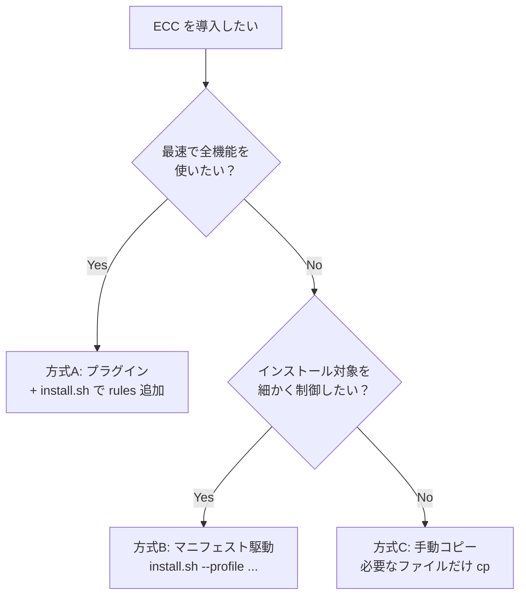

# Everything Claude Code 完全導入ランブック

**作成日:** 2026-03-27
**対象バージョン:** everything-claude-code v1.9.0
**対象者:** ECC の全機能を自分のリポジトリで活用したいユーザー

---

## 目次

1. [前提条件](#1-前提条件)
2. [導入方式の選択](#2-導入方式の選択)
3. [方式A: プラグインインストール](#3-方式a-プラグインインストール)
4. [方式B: マニフェスト駆動インストール](#4-方式b-マニフェスト駆動インストール)
5. [方式C: 手動インストール](#5-方式c-手動インストール)
6. [Hook の設定](#6-hook-の設定)
7. [MCP サーバーの設定](#7-mcp-サーバーの設定)
8. [CLAUDE.md の設定](#8-claudemd-の設定)
9. [コンテキストモードの活用](#9-コンテキストモードの活用)
10. [コマンド・スキル・エージェントの使い方](#10-コマンドスキルエージェントの使い方)
11. [継続学習の設定](#11-継続学習の設定)
12. [マルチハーネス対応](#12-マルチハーネス対応)
13. [運用・メンテナンス](#13-運用メンテナンス)
14. [トラブルシューティング](#14-トラブルシューティング)

---

## 1. 前提条件

### 必須

| 項目 | 要件 |
|------|------|
| Claude Code CLI | v2.1.0 以上 |
| Node.js | v18 以上 |
| パッケージマネージャ | npm, pnpm, yarn, bun のいずれか |
| OS | macOS, Linux, Windows（PowerShell） |

```bash
# バージョン確認
claude --version    # v2.1.0 以上であること
node --version      # v18.0.0 以上であること
```

### 推奨

| 項目 | 用途 |
|------|------|
| Git | セッション永続化 Hook がブランチ情報を記録する |
| tmux | マルチエージェントオーケストレーション |
| Python 3.9+ | InsAIts セキュリティモニタ（オプション） |

---

## 2. 導入方式の選択

ECC には3つの導入方式がある。プロジェクトの状況と求める粒度に応じて選択する。



| 方式 | 所要時間 | 粒度 | 状態追跡 | 向いているケース |
|------|---------|------|---------|--------------|
| A: プラグイン | 2分 | 全部入り + 言語選択 | なし | 素早く全機能を試したい |
| B: マニフェスト駆動 | 5分 | プロファイル/モジュール/コンポーネント単位 | install-state.json で追跡 | 本番導入、チーム展開 |
| C: 手動コピー | 10分 | ファイル単位 | なし | 特定コンポーネントだけ欲しい |

---

## 3. 方式A: プラグインインストール

最も手軽な方法。Claude Code のプラグインシステムを利用する。

### Step 1: プラグインのインストール

Claude Code のセッション内で以下を実行する。

```
/plugin marketplace add affaan-m/everything-claude-code
/plugin install everything-claude-code@everything-claude-code
```

あるいは `~/.claude/settings.json` に直接記述する。

```json
{
  "extraKnownMarketplaces": {
    "everything-claude-code": {
      "source": {
        "source": "github",
        "repo": "affaan-m/everything-claude-code"
      }
    }
  },
  "enabledPlugins": {
    "everything-claude-code@everything-claude-code": true
  }
}
```

この時点で commands, agents, skills, hooks が利用可能になる。ただし、Claude Code のプラグインシステムには rules を配布する機能がないため、rules は別途インストールが必要である。

### Step 2: Rules のインストール

`--target claude`（デフォルト）は `~/.claude/rules/` にインストールされる。これはユーザースコープであり、そのマシン上のすべての Claude Code セッションに適用される。

**特定プロジェクトだけにインストールしたい場合:** v1.9.0 時点で、Claude Code のプロジェクトスコープ（`<project>/.claude/rules/`）に自動インストールするアダプタは存在しない。`--target claude` はユーザースコープ専用である。

| ターゲット | スコープ | インストール先 | 適用範囲 |
|-----------|---------|-------------|---------|
| `claude`（デフォルト） | ユーザー | `~/.claude/rules/` | 全プロジェクト |
| `cursor` | プロジェクト | `./.cursor/` | カレントディレクトリのみ |
| `antigravity` | プロジェクト | `./.agent/` | カレントディレクトリのみ |

たとえば `~/products/novasell-magna` にだけ ECC の rules を適用したい場合、以下の手順で手動コピーする:

```bash
# ECC リポジトリからプロジェクトの .claude/rules/ に直接コピー
cd /path/to/everything-claude-code
cp -r rules/common ~/products/novasell-magna/.claude/rules/common
cp -r rules/typescript ~/products/novasell-magna/.claude/rules/typescript
```

あるいは、`/configure-ecc` スキル（`skills/configure-ecc/SKILL.md`）を使えば、対話的にユーザーレベルかプロジェクトレベルかを選んでコピー先を決定できる。ただしこれもスキルが手順を案内するだけで、install.sh のような自動化されたパイプラインではない。

```bash
# リポジトリをクローン
git clone https://github.com/affaan-m/everything-claude-code.git
cd everything-claude-code
npm install

# 使用言語の rules をインストール（macOS/Linux）
./install.sh typescript          # ユーザースコープ（~/.claude/rules/）
./install.sh typescript python   # 複数言語

# Windows の場合
.\install.ps1 typescript python

# npm 経由（クロスプラットフォーム）
npx ecc typescript python            # 正規コマンド
npx ecc-install typescript python    # 互換エイリアス
```

対応言語: `typescript`, `python`, `golang`, `swift`, `php`, `java`, `perl`, `kotlin`, `cpp`, `rust`, `csharp`

`kotlin` を指定すると内部的には `java` モジュールにマッピングされるが、`rules/kotlin/` ディレクトリも同時にインストールされる。`golang` は `go` のエイリアス、`javascript` は `typescript` のエイリアスとして扱われる。

### Step 3: 動作確認

```
# プラグインの確認
/plugin list everything-claude-code@everything-claude-code

# コマンドの実行テスト（プラグイン経由は名前空間付き）
/everything-claude-code:plan "Hello World"
```

### プラグイン方式での注意点

プラグイン経由のコマンドは名前空間付き（`/everything-claude-code:plan`）になる。短縮形（`/plan`）を使いたい場合は方式B または方式C で直接インストールする。

> インストール完了後、[セクション 7: MCP サーバーの設定](#7-mcp-サーバーの設定) と [セクション 8: CLAUDE.md の設定](#8-claudemd-の設定) に進む。プラグイン方式では Hook は自動で有効になるため、[セクション 6](#6-hook-の設定) は確認だけでよい。

---

## 4. 方式B: マニフェスト駆動インストール

v1.9.0 で導入された本格的なインストール方式。プロファイル・コンポーネント・モジュールの3層で対象を選択でき、インストール状態が JSON で追跡される。

### Step 1: リポジトリの準備

```bash
git clone https://github.com/affaan-m/everything-claude-code.git
cd everything-claude-code
npm install
```

### Step 2: インストールプランの確認

実際にファイルをコピーする前に、何がインストールされるかを確認できる。

```bash
# 利用可能なプロファイルの一覧
node scripts/install-plan.js --list-profiles

# 特定プロファイルの内容を確認
node scripts/install-plan.js --profile developer --json

# ドライラン（ファイルコピーせずプランだけ表示）
./install.sh --dry-run --profile developer --target claude
```

### Step 3: プロファイルの選択

5つのプリセットプロファイルがある。

| プロファイル | 含まれるモジュール数 | 対象ユーザー |
|------------|-------------------|------------|
| `core` | 6 | 最小構成。rules, agents, commands, hooks, 品質ワークフローのみ |
| `developer` | 9 | 標準的なエンジニア。core に加え、言語スキル・DB・オーケストレーション |
| `security` | 7 | セキュリティ重視。core にセキュリティスキルを追加 |
| `research` | 9 | リサーチ・執筆。core に調査API・コンテンツ・SNS配信スキル |
| `full` | 19 | 全モジュール。すべてのスキル・エージェントを含む |

### Step 4: インストールの実行

```bash
# 方法1: プロファイルで指定
./install.sh --profile developer --target claude

# 方法2: プロファイル + 追加コンポーネント
./install.sh --profile developer --with lang:kotlin --with capability:database --target claude

# 方法3: プロファイル + 除外コンポーネント
./install.sh --profile full --without capability:media --target claude

# 方法4: モジュール ID を直接指定（上級者向け）
./install.sh --modules rules-core,agents-core,commands-core,hooks-runtime --target claude

# 方法5: 設定ファイルで指定
./install.sh --config ./ecc-install.json
```

コンポーネントの指定形式は `<family>:<name>` で、たとえば `lang:python`, `lang:typescript`, `capability:database`, `capability:security` などがある。

### Step 5: 設定ファイルによる管理（チーム展開向け）

プロジェクトルートに `ecc-install.json` を置くことで、チームメンバー全員が同じ構成をインストールできる。

```json
{
  "version": 1,
  "target": "claude",
  "profile": "developer",
  "include": ["lang:python", "lang:typescript", "capability:database"],
  "exclude": ["capability:media"]
}
```

```bash
# チームメンバーはこれだけ実行すればよい
./install.sh --config ./ecc-install.json
```

### インストール状態の確認

インストール後、状態ファイルが生成される。

| ターゲット | 状態ファイルのパス |
|-----------|-----------------|
| Claude Code | `~/.claude/ecc/install-state.json` |
| Cursor | `./.cursor/ecc-install-state.json` |
| Antigravity | `./.agent/ecc-install-state.json` |
| Codex | `~/.codex/ecc-install-state.json` |
| OpenCode | `~/.opencode/ecc-install-state.json` |

> インストール完了後、[セクション 6: Hook の設定](#6-hook-の設定)、[セクション 7: MCP サーバーの設定](#7-mcp-サーバーの設定)、[セクション 8: CLAUDE.md の設定](#8-claudemd-の設定) に進む。

---

## 5. 方式C: 手動インストール

ファイル単位で必要なものだけをコピーする方法。プラグインシステムを使わない場合のフル手動手順を示す。

### Step 1: リポジトリの取得

```bash
git clone https://github.com/affaan-m/everything-claude-code.git
```

### Step 2: 各コンポーネントのコピー

以下のディレクトリ構造を前提として説明する。`~/.claude/` がユーザーレベル（全プロジェクトに適用）、`.claude/` がプロジェクトレベル（そのプロジェクトだけに適用）である。

#### Rules（必須）

ルールはディレクトリ構造を維持してコピーする。フラット化（`/*` で展開）してはならない。`common/` と各言語ディレクトリには同名のファイル（`coding-style.md`, `hooks.md`, `patterns.md`, `security.md`, `testing.md`）があり、フラット化すると言語固有ファイルが common を上書きする。README の一部の記述（`cp -r rules/common/* ~/.claude/rules/`）はこの問題を含むため、本ランブックではサブディレクトリごとコピーする手順を採用している。

```bash
# ユーザーレベル（全プロジェクトに適用）
mkdir -p ~/.claude/rules
cp -r everything-claude-code/rules/common ~/.claude/rules/common

# 使用する言語だけ追加（必要なものだけ選ぶ）
cp -r everything-claude-code/rules/typescript ~/.claude/rules/typescript
cp -r everything-claude-code/rules/python ~/.claude/rules/python
cp -r everything-claude-code/rules/golang ~/.claude/rules/golang
cp -r everything-claude-code/rules/swift ~/.claude/rules/swift
cp -r everything-claude-code/rules/php ~/.claude/rules/php

# v1.9.0 で追加された言語（rules/ にまだディレクトリがない場合はスキルで代替）
# Java, Perl, Kotlin, C++, Rust のルールは rules/{lang}/ に5ファイルで構成
```

```bash
# プロジェクトレベル（そのプロジェクトだけに適用）
mkdir -p .claude/rules
cp -r everything-claude-code/rules/common .claude/rules/common
cp -r everything-claude-code/rules/typescript .claude/rules/typescript
```

#### Agents

```bash
mkdir -p ~/.claude/agents
cp everything-claude-code/agents/*.md ~/.claude/agents/
```

28体のエージェント全てがコピーされる。特定のエージェントだけ欲しい場合は個別にコピーする。

```bash
# 例: コードレビュー系だけ
cp everything-claude-code/agents/code-reviewer.md ~/.claude/agents/
cp everything-claude-code/agents/python-reviewer.md ~/.claude/agents/
cp everything-claude-code/agents/typescript-reviewer.md ~/.claude/agents/
cp everything-claude-code/agents/security-reviewer.md ~/.claude/agents/
```

#### Commands

```bash
mkdir -p ~/.claude/commands
cp everything-claude-code/commands/*.md ~/.claude/commands/
```

#### Skills

スキルは数が多い（125以上）。全てコピーすると大量のコンテキストを消費するため、必要なものだけ選択する。

```bash
mkdir -p ~/.claude/skills

# コアスキル（ほぼ全員に有用）
for s in tdd-workflow verification-loop security-review search-first coding-standards; do
  cp -r everything-claude-code/skills/$s ~/.claude/skills/
done

# 言語・フレームワークスキル（プロジェクトに合わせて選択）
# TypeScript / React / Next.js
for s in frontend-patterns backend-patterns e2e-testing api-design; do
  cp -r everything-claude-code/skills/$s ~/.claude/skills/
done

# Python
for s in python-patterns python-testing django-patterns django-tdd; do
  cp -r everything-claude-code/skills/$s ~/.claude/skills/
done

# Go
for s in golang-patterns golang-testing; do
  cp -r everything-claude-code/skills/$s ~/.claude/skills/
done

# Java / Spring Boot
for s in springboot-patterns springboot-tdd springboot-security jpa-patterns java-coding-standards; do
  cp -r everything-claude-code/skills/$s ~/.claude/skills/
done

# Kotlin / Android / KMP
for s in kotlin-patterns kotlin-testing kotlin-coroutines-flows kotlin-ktor-patterns compose-multiplatform-patterns android-clean-architecture; do
  cp -r everything-claude-code/skills/$s ~/.claude/skills/
done

# Rust
for s in rust-patterns rust-testing; do
  cp -r everything-claude-code/skills/$s ~/.claude/skills/
done

# C++
for s in cpp-coding-standards cpp-testing; do
  cp -r everything-claude-code/skills/$s ~/.claude/skills/
done

# Perl
for s in perl-patterns perl-testing perl-security; do
  cp -r everything-claude-code/skills/$s ~/.claude/skills/
done

# Laravel (PHP)
for s in laravel-patterns laravel-tdd laravel-security; do
  cp -r everything-claude-code/skills/$s ~/.claude/skills/
done

# Swift
for s in swiftui-patterns swift-concurrency-6-2 swift-actor-persistence foundation-models-on-device liquid-glass-design; do
  cp -r everything-claude-code/skills/$s ~/.claude/skills/
done

# DB
for s in postgres-patterns database-migrations; do
  cp -r everything-claude-code/skills/$s ~/.claude/skills/
done

# DevOps
for s in deployment-patterns docker-patterns; do
  cp -r everything-claude-code/skills/$s ~/.claude/skills/
done

# AI / エージェント運用
for s in continuous-learning-v2 autonomous-loops agentic-engineering agent-harness-construction; do
  cp -r everything-claude-code/skills/$s ~/.claude/skills/
done
```

> 手動コピー完了後、[セクション 6: Hook の設定](#6-hook-の設定)（必須）、[セクション 7: MCP サーバーの設定](#7-mcp-サーバーの設定)、[セクション 8: CLAUDE.md の設定](#8-claudemd-の設定) に進む。

---

## 6. Hook の設定

Hook は Claude Code のツール実行前後に自動実行されるスクリプトである。ECC の価値の大部分はこの Hook にある。

### プラグイン方式の場合

プラグインをインストールすると、`hooks/hooks.json` は自動的に読み込まれる。追加の設定は不要。

**注意:** Claude Code v2.1+ はプラグインの `hooks/hooks.json` を自動で検出する。`.claude-plugin/plugin.json` に `"hooks"` フィールドを追加すると重複検出エラーになる。

### 手動インストールの場合

`hooks/hooks.json` の内容を `~/.claude/settings.json` にマージする。

```bash
# hooks.json の内容を確認
cat everything-claude-code/hooks/hooks.json
```

`~/.claude/settings.json` に `hooks` セクションを追加する。

```json
{
  "hooks": {
    "PreToolUse": [
      {
        "matcher": "Bash",
        "hooks": [
          {
            "type": "command",
            "command": "npx block-no-verify@1.1.2"
          }
        ],
        "description": "Block git hook-bypass flag"
      }
    ],
    "PostToolUse": [],
    "Stop": []
  }
}
```

実際のフックは数十個あるため、`hooks/hooks.json` の全内容を確認してからマージすること。

### ECC が提供する主要な Hook

| フェーズ | Hook | 機能 |
|---------|------|------|
| PreToolUse (Bash) | block-no-verify | `--no-verify` フラグをブロックし、Git フックのバイパスを防止 |
| PreToolUse (Bash) | auto-tmux-dev | dev サーバーを tmux で自動起動 |
| PreToolUse (Bash) | tmux-reminder | 長時間コマンドに tmux の使用を推奨 |
| PreToolUse (Bash) | git-push-reminder | git push 前のレビュー確認 |
| PreToolUse (Write) | doc-file-warning | 非標準のドキュメントファイル作成を警告 |
| PreToolUse (Edit\|Write) | suggest-compact | コンテキストの戦略的コンパクション提案 |
| PreToolUse (*) | observe | ツール呼び出しを記録（継続学習用、非同期） |
| PostToolUse (Edit\|Write) | post-edit-format | 編集後の自動フォーマット（Biome 対応） |
| PostToolUse (Edit\|Write) | insaits-security | セキュリティモニタリング（オプション） |
| Stop | session-end | セッション終了時の状態保存 |
| Stop | desktop-notify | デスクトップ通知（macOS） |

### Hook のランタイム制御

```bash
# Hook の厳格さプロファイル（minimal / standard / strict）
export ECC_HOOK_PROFILE=standard

# 特定の Hook を無効化
export ECC_DISABLED_HOOKS="pre:bash:tmux-reminder,post:edit:typecheck"
```

| プロファイル | 実行される Hook |
|------------|---------------|
| `minimal` | block-no-verify のみ。CI 環境やサブプロセス向け |
| `standard` | ほとんどの Hook が有効。日常の開発向け（デフォルト） |
| `strict` | 全 Hook が有効。本番前のチェック向け |

---

## 7. MCP サーバーの設定

MCP（Model Context Protocol）サーバーは Claude Code に外部ツールの能力を追加する。ECC は `mcp-configs/mcp-servers.json` に22の事前定義サーバーを提供している。

### 設定方法

`~/.claude.json` の `mcpServers` セクションに、使いたいサーバーの定義をコピーする。MCP サーバーの定義先は `~/.claude.json` であり、プラグインの有効化やフックの設定先である `~/.claude/settings.json` とは異なるファイルである点に注意する。

```bash
# 定義ファイルを確認
cat everything-claude-code/mcp-configs/mcp-servers.json
```

### 推奨する MCP サーバー（用途別）

#### 開発必携

| サーバー | 用途 | API キー |
|---------|------|---------|
| `github` | PR・Issue 操作 | `GITHUB_PERSONAL_ACCESS_TOKEN` |
| `context7` | ライブラリの最新ドキュメント参照 | 不要 |

#### Web リサーチ

| サーバー | 用途 | API キー |
|---------|------|---------|
| `firecrawl` | Web スクレイピング | `FIRECRAWL_API_KEY` |
| `exa-web-search` | ニューラル検索 | `EXA_API_KEY` |

#### インフラ・デプロイ

| サーバー | 用途 | API キー |
|---------|------|---------|
| `vercel` | Vercel デプロイ | 不要（HTTP 接続） |
| `railway` | Railway デプロイ | 不要 |
| `cloudflare-docs` | Cloudflare ドキュメント検索 | 不要（HTTP 接続） |
| `cloudflare-workers-builds` | Workers ビルド | 不要（HTTP 接続） |

#### データベース

| サーバー | 用途 | API キー |
|---------|------|---------|
| `supabase` | Supabase DB 操作 | `--project-ref` で指定 |
| `clickhouse` | ClickHouse 分析クエリ | 不要（HTTP 接続） |

#### セキュリティ

| サーバー | 用途 | API キー |
|---------|------|---------|
| `insaits` | AI-to-AI セキュリティ監視 | 不要（ローカル、`pip install insa-its`） |

#### メディア・ブラウザ

| サーバー | 用途 | API キー |
|---------|------|---------|
| `playwright` | ブラウザ自動操作 | 不要 |
| `fal-ai` | 画像・動画・音声生成 | `FAL_KEY` |

#### 設定例

```json
{
  "mcpServers": {
    "github": {
      "command": "npx",
      "args": ["-y", "@modelcontextprotocol/server-github"],
      "env": {
        "GITHUB_PERSONAL_ACCESS_TOKEN": "ghp_xxxxxxxxxxxx"
      }
    },
    "context7": {
      "command": "npx",
      "args": ["-y", "@upstash/context7-mcp@latest"]
    }
  }
}
```

### コンテキストウィンドウの注意

各 MCP サーバーのツール定義はコンテキストウィンドウを消費する。10以上の MCP を有効にすると、200k トークンのウィンドウが 70k 程度まで縮小する場合がある。プロジェクトごとに不要な MCP を無効化する。

```json
// .claude/settings.json（プロジェクトレベル）
{
  "disabledMcpServers": ["supabase", "railway", "vercel", "fal-ai"]
}
```

---

## 8. CLAUDE.md の設定

`CLAUDE.md` はプロジェクトルートに配置する指示ファイルで、Claude Code がセッション開始時に自動的に読み込む。ECC の `examples/` に実践的なテンプレートが用意されている。

### テンプレートの選択

| テンプレート | ファイル | 対象 |
|------------|---------|------|
| 汎用 | `examples/CLAUDE.md` | あらゆるプロジェクト |
| ユーザーレベル | `examples/user-CLAUDE.md` | `~/.claude/CLAUDE.md` に配置 |
| Next.js + Supabase + Stripe | `examples/saas-nextjs-CLAUDE.md` | SaaS アプリ |
| Go マイクロサービス | `examples/go-microservice-CLAUDE.md` | gRPC + PostgreSQL |
| Django REST API | `examples/django-api-CLAUDE.md` | DRF + Celery |
| Laravel API | `examples/laravel-api-CLAUDE.md` | PostgreSQL + Redis |
| Rust API | `examples/rust-api-CLAUDE.md` | Axum + SQLx + PostgreSQL |

### 推奨する CLAUDE.md の構成

```bash
# テンプレートをコピーしてカスタマイズ
cp everything-claude-code/examples/CLAUDE.md ./CLAUDE.md
```

記載すべき内容:

1. **プロジェクト概要** — 何をするアプリか、技術スタック
2. **コード規約** — ファイル構成、命名規則、スタイル
3. **テスト方針** — TDD、カバレッジ要件、テストの種類
4. **セキュリティ方針** — シークレット管理、入力検証
5. **実行コマンド** — ビルド、テスト、デプロイの各コマンド

---

## 9. コンテキストモードの活用

`contexts/` にはセッションの目的に応じたモード設定ファイルがある。Claude Code にセッション冒頭で読み込ませることで、振る舞いの方向性を制御する。

| モード | ファイル | 振る舞い |
|-------|---------|---------|
| 開発 | `contexts/dev.md` | コードを先に書き、動くものを優先。テストを変更後に実行 |
| レビュー | `contexts/review.md` | コードの品質・セキュリティ・保守性に焦点 |
| リサーチ | `contexts/research.md` | 探索・調査・情報収集に最適化 |

使い方: セッションの最初にコンテキストファイルの内容を指示として渡す。

---

## 10. コマンド・スキル・エージェントの使い方

### 主要コマンド一覧

コマンドはスラッシュ (`/`) で呼び出す。プラグイン経由の場合は名前空間付き（`/everything-claude-code:plan`）になる。

#### 計画・設計

| コマンド | 機能 |
|---------|------|
| `/plan` | 要件の明確化とステップバイステップの実装計画を作成 |
| `/orchestrate` | マルチエージェントの調整ガイダンス |

#### コーディング

| コマンド | 機能 |
|---------|------|
| `/tdd` | テスト駆動開発ワークフローの強制 |
| `/build-fix` | ビルドエラーの修正 |

#### 品質

| コマンド | 機能 |
|---------|------|
| `/code-review` | コード品質・セキュリティレビュー |
| `/go-review` | Go コードレビュー |
| `/python-review` | Python コードレビュー |
| `/verify` | 検証ループの実行 |
| `/checkpoint` | 検証状態の保存 |
| `/e2e` | E2E テストの生成と実行 |
| `/test-coverage` | テストカバレッジの分析 |
| `/security-scan` | AgentShield によるセキュリティ監査 |

#### リファクタリング・ドキュメント

| コマンド | 機能 |
|---------|------|
| `/refactor-clean` | デッドコードの検出と除去 |
| `/update-docs` | ドキュメントの更新 |
| `/update-codemaps` | コードマップの更新 |

#### 学習・パターン抽出

| コマンド | 機能 |
|---------|------|
| `/learn` | セッション中にパターンを抽出 |
| `/learn-eval` | パターンを抽出し、評価してから保存 |
| `/skill-create` | Git 履歴からスキルを生成 |
| `/instinct-status` | 学習済みインスティンクトの確認 |
| `/evolve` | インスティンクトをスキルに進化 |

#### 言語別テスト

| コマンド | 機能 |
|---------|------|
| `/go-test` | Go の TDD ワークフロー |
| `/go-build` | Go ビルドエラーの修正 |
| `/kotlin-test` | Kotlin の TDD ワークフロー |
| `/kotlin-build` | Kotlin ビルドエラーの修正 |
| `/cpp-test` | C++ の TDD ワークフロー |
| `/cpp-build` | C++ ビルドエラーの修正 |
| `/rust-test` | Rust の TDD ワークフロー |
| `/rust-build` | Rust ビルドエラーの修正 |
| `/gradle-build` | Android/KMP の Gradle ビルドエラー修正 |

### 典型的なワークフロー

#### 新機能の開発

```
/plan "OAuth 認証の追加"          → 実装計画の作成
/tdd                              → テストを先に書いてから実装
/code-review                      → コード品質のチェック
/security-scan                    → セキュリティ監査
```

#### バグの修正

```
/tdd                              → 再現するテストを書く → 修正 → テスト通過
/code-review                      → リグレッションの確認
```

#### 本番前の確認

```
/security-scan                    → OWASP Top 10 監査
/e2e                              → クリティカルパスのテスト
/test-coverage                    → 80%+ カバレッジの確認
/verify                           → 総合検証ループ
```

### AgentShield によるセキュリティ監査

```bash
# クイックスキャン（インストール不要）
npx ecc-agentshield scan

# 安全な問題の自動修正
npx ecc-agentshield scan --fix

# 3体の Opus エージェントによる深層分析（レッドチーム/ブルーチーム/監査）
npx ecc-agentshield scan --opus --stream

# セキュアな設定をゼロから生成
npx ecc-agentshield init
```

検査対象: CLAUDE.md, settings.json, MCP 設定, Hook 定義, エージェント定義, スキル。5カテゴリ（シークレット検出、権限監査、Hook インジェクション分析、MCP サーバーリスク、エージェント設定）。

---

## 11. 継続学習の設定

ECC は使うほど賢くなる。継続学習システム（Continuous Learning v2）がセッション中のツール呼び出しパターンを記録し、繰り返し現れるパターンをインスティンクト（学習済み知識）として保存する。

### 仕組み

1. `observe.sh` Hook がツール呼び出しを `observations.jsonl` に記録（非同期、20件ごと）
2. 蓄積した観測データを Haiku が分析
3. 繰り返し出現するパターンを confidence スコア付きのインスティンクトとして保存
4. 以降のセッションでコンテキストとして自動参照

### 確認と管理

```
/instinct-status        # 学習済みインスティンクトの確認（confidence スコア付き）
/instinct-export        # インスティンクトのエクスポート（チームで共有）
/instinct-import <file> # 他の人のインスティンクトをインポート
/evolve                 # 関連するインスティンクトをスキルに統合
/prune                  # 30日以上の未昇格インスティンクトを削除
```

### Observer の安全装置

Observer は5層のガードで無限ループを防止している。

1. エントリポイントチェック（自動セッションはスキップ）
2. `ECC_HOOK_PROFILE=minimal` でスキップ
3. `ECC_SKIP_OBSERVE=1` で明示的にスキップ
4. サブエージェント検出（`agent_id` の存在確認）
5. CWD パス除外（observer-sessions 等のパスをスキップ）

---

## 12. マルチハーネス対応

ECC は Claude Code 以外のハーネスもサポートしている。`--target` フラグでインストール先を切り替える。

### 対応ハーネス

| ハーネス | ターゲット | インストール先 | 種別 |
|---------|-----------|-------------|------|
| Claude Code | `claude` | `~/.claude/` | ユーザーホーム |
| Cursor | `cursor` | `./.cursor/` | プロジェクト |
| Antigravity | `antigravity` | `./.agent/` | プロジェクト |
| Codex | `codex` | `~/.codex/` | ユーザーホーム |
| OpenCode | `opencode` | `~/.opencode/` | ユーザーホーム |

### Cursor へのインストール

```bash
# プロジェクトディレクトリで実行
./install.sh --target cursor typescript python
# または
./install.sh --profile developer --target cursor
```

Cursor の場合、ルールはフラット化される（`rules/python/django.md` → `.cursor/rules/python-django.md`）。

### Antigravity へのインストール

```bash
./install.sh --target antigravity typescript
```

Antigravity ではコマンドが `workflows` に、エージェントとスキルが `skills` にマッピングされる。

---

## 13. 運用・メンテナンス

### パッケージマネージャの設定

ECC は npm, pnpm, yarn, bun を自動検出する。明示的に設定する場合:

```bash
# 環境変数で指定
export CLAUDE_PACKAGE_MANAGER=pnpm

# グローバル設定
node scripts/setup-package-manager.js --global pnpm

# プロジェクト設定
node scripts/setup-package-manager.js --project bun

# 現在の設定を確認
node scripts/setup-package-manager.js --detect

# Claude Code セッション内で設定
/setup-pm
```

検出の優先順位: 環境変数 → プロジェクト設定 → package.json → ロックファイル → グローバル設定 → フォールバック

### ECC の更新

```bash
cd everything-claude-code
git pull origin main
npm install

# マニフェスト駆動の場合、再インストールで差分が反映される
./install.sh --profile developer --target claude
```

### テストの実行

```bash
# 全テスト
node tests/run-all.js

# 個別テスト
node tests/lib/utils.test.js
node tests/lib/package-manager.test.js
node tests/hooks/hooks.test.js
```

### インストール状態の管理

マニフェスト駆動インストール（方式B）を使った場合、状態追跡ツールが利用できる。ECC リポジトリのディレクトリ内で実行する。

```bash
# インストール済みモジュールの一覧を表示
node scripts/list-installed.js

# ファイルの欠損・変更・破損を診断
node scripts/doctor.js

# 欠損ファイルを自動復元
node scripts/repair.js
```

定期的に `doctor.js` を実行して、手動でファイルを削除してしまった場合や ECC のアップデート後にインストール状態が健全かを確認するとよい。

### ハーネス監査

ECC のセットアップ状態を70点満点でスコアリングする。

```
/harness-audit
```

7カテゴリ各10点、合計70点で評価される:

| カテゴリ | 最大点 | 評価内容 |
|---------|-------|---------|
| Tool Coverage | 10 | hooks.json の存在、Hook スクリプト数、スキル数 |
| Context Efficiency | 10 | 戦略的コンパクション、モデルルーティング、コスト認識 |
| Quality Gates | 10 | テスト、リンティング、CI カバレッジ |
| Memory Persistence | 10 | 状態ストア、意思決定ログ、クラッシュ復旧 |
| Eval Coverage | 10 | 評価ハーネス、テストスキャフォールド |
| Security Guardrails | 10 | リスクスコアリング、サプライチェーン検証 |
| Cost Efficiency | 10 | トークン予算、スロットリング |

---

## 14. トラブルシューティング

### "Duplicate hooks file detected" エラー

Claude Code v2.1+ はプラグインの `hooks/hooks.json` を自動検出する。`.claude-plugin/plugin.json` に `"hooks"` フィールドがあると重複エラーになる。プラグインの `plugin.json` を編集してはならない。

### コンテキストウィンドウの枯渇

**症状:** "Context too long" エラー、応答の途切れ

**対策:**
1. 不要な MCP サーバーをプロジェクトごとに無効化する
2. 10 MCP 以下、80 ツール以下に抑える
3. `/context-budget` で消費量を分析する

```json
{
  "disabledMcpServers": ["supabase", "railway", "vercel"]
}
```

### Hook が動かない

```bash
# Hook の設定を確認
grep -r "hooks" ~/.claude/settings.json

# Hook プロファイルを確認
echo $ECC_HOOK_PROFILE

# 特定の Hook が無効化されていないか確認
echo $ECC_DISABLED_HOOKS
```

### メモリ永続化が機能しない

```bash
# 観測ファイルの確認
ls ~/.claude/homunculus/projects/*/observations.jsonl

# プロジェクトハッシュの確認
python3 -c "
import json, os
with open(os.path.expanduser('~/.claude/homunculus/projects.json')) as f:
    registry = json.load(f)
for pid, meta in registry.items():
    if meta.get('root') == os.getcwd():
        print(pid)
        break
"

# 最近の観測を確認
tail -20 ~/.claude/homunculus/projects/<hash>/observations.jsonl
```

### インストール状態の修復

マニフェスト駆動インストールの場合、専用の CLI ツールで診断・修復ができる。ECC リポジトリのディレクトリ内で実行する。

```bash
# インストール済みモジュールの一覧
node scripts/list-installed.js

# 健全性の診断（欠損・変更・破損ファイルの検出）
node scripts/doctor.js

# 欠損ファイルの復元
node scripts/repair.js

# 状態ファイルの直接確認（Claude Code の場合）
python3 -m json.tool < ~/.claude/ecc/install-state.json
```

### カスタム API エンドポイントでの利用

ECC は Anthropic 固有のトランスポート設定をハードコードしていない。カスタムゲートウェイでも動作する。

```bash
export ANTHROPIC_BASE_URL=https://your-gateway.example.com
export ANTHROPIC_AUTH_TOKEN=your-token
claude
```

---

## 付録: クイックリファレンス

### 最小構成でのセットアップ（5分）

```bash
# 1. クローンと依存解決
git clone https://github.com/affaan-m/everything-claude-code.git
cd everything-claude-code && npm install

# 2. Rules + Agents + Commands をインストール
./install.sh --profile core --target claude

# 3. GitHub MCP を設定（~/.claude.json に追記）
# { "mcpServers": { "github": { ... } } }

# 4. 動作確認
claude
/plan "Hello ECC"
```

### フル構成でのセットアップ（10分）

```bash
# 1. クローンと依存解決
git clone https://github.com/affaan-m/everything-claude-code.git
cd everything-claude-code && npm install

# 2. 全モジュールをインストール
./install.sh --profile full --target claude

# 3. MCP サーバーを設定（必要なものだけ）
# mcp-configs/mcp-servers.json から選んで ~/.claude.json に追記

# 4. CLAUDE.md をプロジェクトに配置
cp examples/CLAUDE.md /path/to/your-project/CLAUDE.md
# 内容をプロジェクトに合わせてカスタマイズ

# 5. 動作確認
cd /path/to/your-project
claude
/plan "プロジェクトの概要を教えて"
/harness-audit
/instinct-status
```
